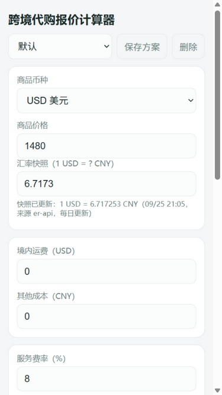

**[中文](README.zh-CN.md) | [English](README.en.md)**

<h1 align="center">Daigou Quote Calculator</h1>

<p align="center">
  
  
</p>

<p align="center">A quote calculator for cross-border proxy shoppers — enter the price in foreign currency, see what to charge the client and what you actually earn.</p>

<p align="center">
  
</p>

## What it is

A quoting tool for overseas daigou / personal shoppers. It is not a currency converter — conversion is only step one. It walks the entire quote chain:

rate snapshot → safety buffer → purchase cost (incl. domestic shipping and extras) → (advanced mode: itemized payment-chain costs) → service fee (rate vs. minimum, whichever is higher) → platform-fee gross-up → suggested quote (with rounding) → expected profit.

A pure-static PWA: no backend, no accounts. All math runs locally in your browser, and it works offline once added to your home screen. 12 currencies supported (JPY / USD / EUR / GBP / KRW / HKD / TWD / SGD / AUD / CAD / PHP / CNY), settlement currency is not hardcoded.

## Why I built this

Every time I quoted a client I had to punch a long chain into a calculator: market rate, add a safety buffer, convert domestic shipping, apply the service fee with a ¥10 floor, then the platform takes a cut out of the final price — which means you can't just multiply, you have to gross up (divide by 1 − rate). One slip and the loss comes out of my own pocket.

Existing tools are either plain currency converters or locked to one platform. So I turned my own quoting habit into a tool: every rate is adjustable, fee presets save and switch in one tap, and the result copies to the clipboard for the client. Built for me first, and for everyone still hand-calculating prices in the daigou groups.

## Quick start

Nothing to install —

> [!TIP]
> Open [yhlorra.github.io/daigou-quote-calculator](https://yhlorra.github.io/daigou-quote-calculator/) on your phone and use "Add to Home Screen" for an offline-capable app.

Local development:

```bash
npm install
npm run dev        # http://127.0.0.1:8790
```

## Features

- ✅ **Live calculation** — change any input and the quote panel refreshes within 300ms, no button press
- ✅ **Complete fee model** — exchange buffer, minimum service fee (max of the two, never additive), platform-fee gross-up (÷(1−rate)), four rounding modes
- ✅ **Ordinary / advanced modes** — keep ordinary quotes simple; advanced mode adds custom payment-chain cost steps with per-step rates, using the higher of observed loss and rate estimate for each step
- ✅ **Fee presets** — built-in Xianyu / friend price / high-ticket / scalping presets, plus custom ones persisted in localStorage
- ✅ **Rate snapshots** — er-api primary + frankfurter fallback, updated daily, source and timestamp shown honestly (never claimed as "real-time"); auto-aligned on page open and currency switch, manual overrides never clobbered
- ✅ **Offline** — full calculator without network, snapshot falls back to the last cached value
- ✅ **Copy quote** — paste the itemized quote straight to your client

## Pricing formula

```
effective rate = rate × (1 + buffer)
base cost      = price×effective rate + shipping×effective rate + extras
advanced fees  = sum(max(pre-step cumulative cost×step rate, observed step loss))
purchase cost  = base cost + advanced fees
service fee    = max(purchase cost × service rate, minimum fee)   ← higher of the two, never additive
quote          = (purchase cost + service fee) ÷ (1 − platform rate) ← gross-up: platform skims the final price
profit         = quote − purchase cost − quote×platform rate
```

## Deployment

Pushes to `main` / `master` are built, tested, and published to GitHub Pages automatically (`.github/workflows/deploy.yml`). The site uses relative paths throughout, so project subpaths and custom domains both work; with no server, any static host will do.

## Testing

```sh
npm test    # pricing unit tests: fee floor, gross-up, rounding modes, float-precision edge cases
```

## Known limits

**Good for:**
- ✅ Individual daigou / small teams quoting clients fast
- ✅ Businesses juggling multiple platforms and fee schemes

**Not ideal for:**
- ❌ Multi-device sync or team collaboration — no accounts, data lives in local localStorage only
- ❌ Bookkeeping / multi-currency ledgers — it quotes, it doesn't keep books

### About the rate source

Rates come from **er-api** (free snapshot updated once a day) and **frankfurter** (fallback, no TWD / PHP). The UI shows the source and timestamp honestly and never claims "real-time". Your actual settlement rate depends on your payment channel — keep a 1–3% buffer as a hedge.

## About the author

**Chu Quan (楚泉)** — a non-engineer who builds things

- [GitHub](https://github.com/YHlorra)

## License

MIT License. See [LICENSE](LICENSE).
